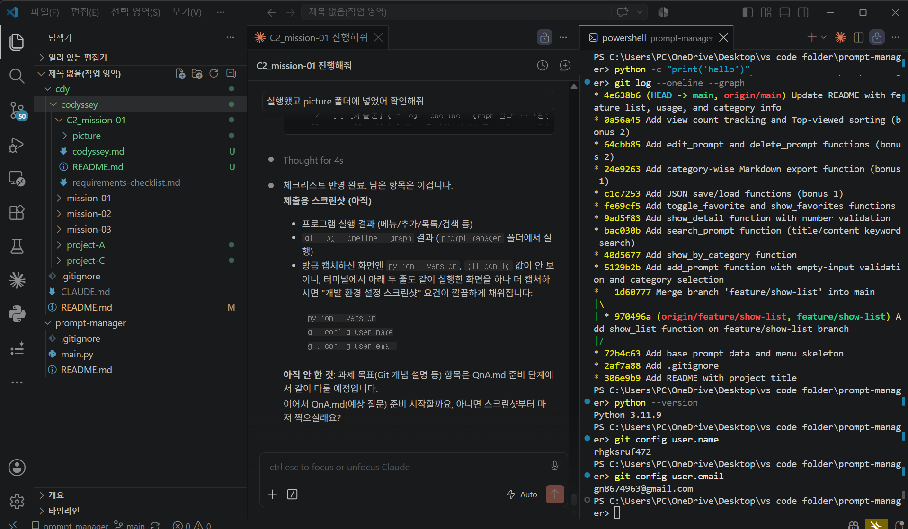
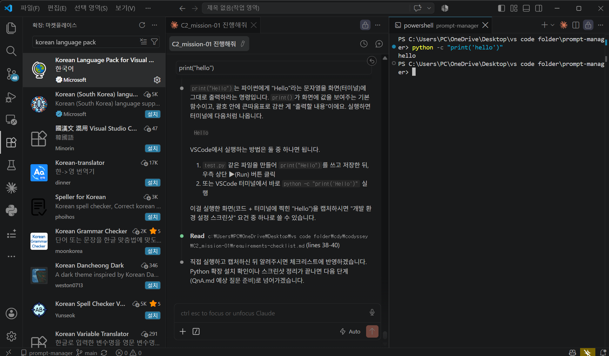
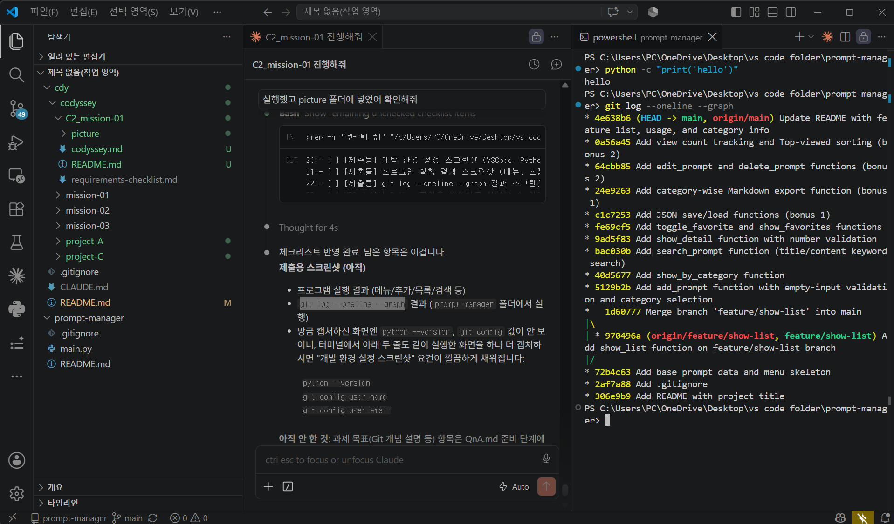
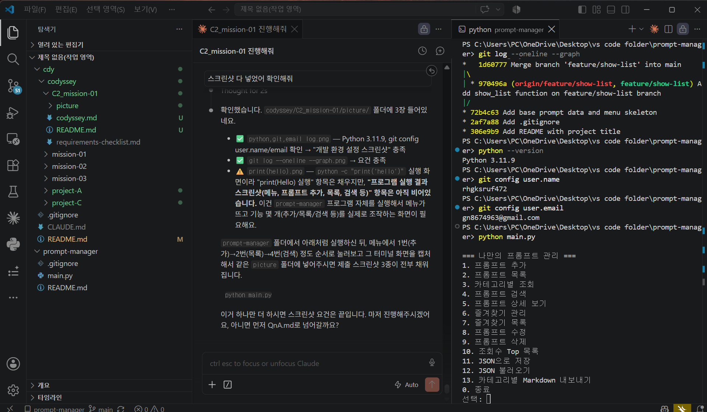
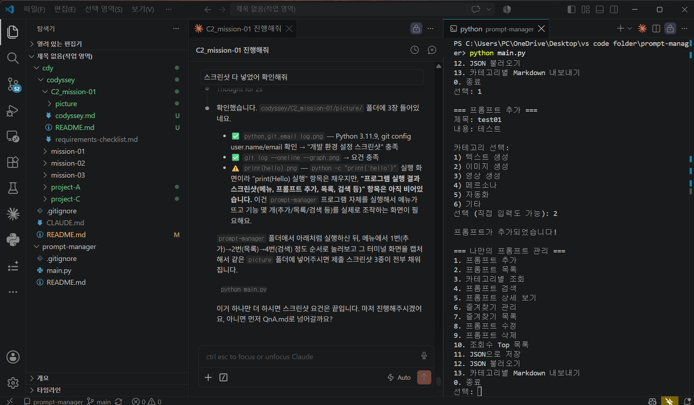
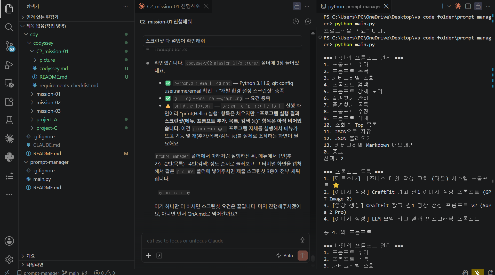
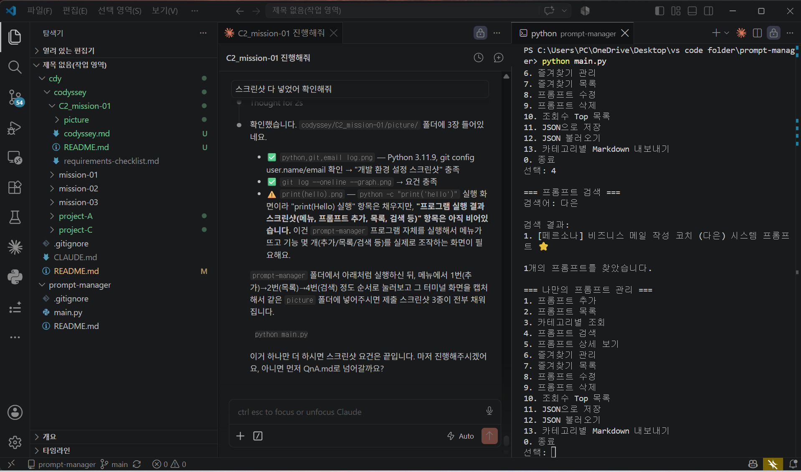

# Mission C2-01 — Python & Git 기초

> 이전 미션들에서 쌓인 프롬프트를 관리하는 **콘솔 기반 파이썬 프로그램**을 만들고,
> 그 개발 과정을 **Git으로 버전 관리**하며 **GitHub에 공개**하는 미션입니다.

| 항목 | 내용 |
|---|---|
| **프로그램 저장소** | **https://github.com/rhgksruf472/Prompt-manager** |
| 프로그램 | `main.py` — 콘솔 기반 프롬프트 관리 (함수 18개) |
| 커밋 | 15개 (기능 단위, 병합 커밋 1개 포함) |
| 브랜치 | `feature/show-list` → `main` 병합 (`--no-ff`) |
| 보너스 | 보너스 1·2 **전부 구현** (JSON 저장/불러오기, MD 내보내기, 수정/삭제, 조회수 Top) |
| 과제 원문 | [`codyssey.md`](codyssey.md) |

---

## 목차

1. [미션 요약](#미션-요약)
2. [실행 방법](#실행-방법)
3. [프로그램 기능](#프로그램-기능)
4. [기본 등록 프롬프트](#기본-등록-프롬프트-이전-미션-재사용)
5. [Git 작업 기록](#git-작업-기록)
6. [제출용 스크린샷](#제출용-스크린샷)
7. [과제 목표 대응표](#과제-목표-대응표)
8. [재현성 기록](#재현성-기록)

---

## 미션 요약

이번 미션의 핵심은 AI 활용이 아니라 **Python 기초 문법**과 **Git 명령어**(`init` / `add` / `commit` / `push` / `pull` / `checkout` / `clone` / `merge`)를 직접 손으로 익히는 것입니다.

- 프롬프트 **추가 / 목록 / 카테고리별 조회 / 검색 / 상세 보기 / 즐겨찾기** 6가지 핵심 기능
- Chapter 1 이전 미션(C1_mission-01, C1_mission-02)에서 **실제로 작성했던 프롬프트 4개**를 기본 데이터로 재사용
- "목록 보기" 기능은 별도 브랜치에서 작업 후 main으로 병합
- **보너스 1** — JSON 저장/불러오기, 카테고리별 Markdown 내보내기
- **보너스 2** — 프롬프트 수정/삭제(CRUD), 조회수 기록, 조회수 Top 정렬

### 저장소 구조 (이 미션만 예외)

이번 미션은 "GitHub 저장소 1개"가 그 자체로 산출물이라, **실제 프로그램 코드는 이 `cdy` 저장소가 아니라 독립된 별도 저장소**에 있습니다.

```
📦 rhgksruf472/Prompt-manager   ← 프로그램 코드 (별도 저장소)
├── main.py                     프로그램 본체 (함수 18개)
├── README.md                   프로그램 설명·실행 방법·기능 목록
└── .gitignore

📂 cdy/codyssey/chapter-2/C2_mission-01/  ← 이 폴더 (학습 기록)
├── README.md                   이 문서 — 평가자용 미션 정리
├── codyssey.md                 과제 원문
└── picture/                    제출용 스크린샷 7장
```

## 실행 방법

Python 3.10 이상이 필요합니다. 외부 라이브러리는 설치하지 않아도 됩니다.

```bash
git clone https://github.com/rhgksruf472/Prompt-manager.git
cd Prompt-manager
python main.py
```

실행하면 메뉴가 출력되고, 번호를 입력해 기능을 선택합니다. 잘못된 번호를 넣으면 안내 메시지가 나온 뒤 다시 메뉴로 돌아옵니다. `0`을 누르면 종료됩니다.

## 프로그램 기능

### 기본 기능

| 번호 | 기능 | 설명 |
|:---:|---|---|
| 1 | 프롬프트 추가 | 제목·내용·카테고리 입력, **빈 값이면 재입력 요청** |
| 2 | 프롬프트 목록 | 번호·카테고리·즐겨찾기(⭐) 표시 |
| 3 | 카테고리별 조회 | 카테고리 선택 → 해당 프롬프트만 출력 |
| 4 | 프롬프트 검색 | 제목 + 내용 키워드 검색 |
| 5 | 프롬프트 상세 보기 | 제목·카테고리·즐겨찾기·전체 내용 출력 |
| 6 | 즐겨찾기 관리 | 번호 입력으로 추가/해제 (토글) |
| 7 | 즐겨찾기 목록 | 즐겨찾기한 프롬프트만 모아보기 |
| 0 | 종료 | 프로그램 종료 |

### 보너스 기능

| 번호 | 기능 | 설명 |
|:---:|---|---|
| 8 | 프롬프트 수정 | Enter만 누르면 기존 값 유지 |
| 9 | 프롬프트 삭제 | 확인(y/n) 후 삭제 |
| 10 | 조회수 Top 목록 | 상세 보기 횟수 기준 정렬 |
| 11 | JSON으로 저장 | `prompts_data.json`으로 저장 |
| 12 | JSON 불러오기 | 저장된 파일에서 복원 |
| 13 | 카테고리별 MD 내보내기 | `exports/<카테고리명>.md` 생성 |

> 전 기능을 시나리오 테스트로 검증했습니다 — 카테고리에 결과가 없을 때 안내, 검색 결과 없음 안내, 잘못된 번호 입력 처리 등 **예외 케이스 포함**.

## 기본 등록 프롬프트 (이전 미션 재사용)

과제 요구사항("이전 미션에서 작성한 프롬프트를 최소 3개 이상 기본 데이터로 등록")에 따라, 새로 지어내지 않고 **이전 미션에서 실제로 작성했던 프롬프트**를 그대로 가져와 등록했습니다.

| 제목 | 카테고리 | 출처 |
|---|---|---|
| 비즈니스 메일 작성 코치 (다은) 시스템 프롬프트 | 페르소나 | [C1_mission-01 system-design.md](../../chapter-1/C1_mission-01/system-design/system-design.md) |
| CraftFit 광고 씬1 이미지 생성 프롬프트 (GPT Image 2) | 이미지 생성 | [C1_mission-02 storyboard.md](../../chapter-1/C1_mission-02/storyboard/storyboard.md) |
| CraftFit 광고 씬1 영상 생성 프롬프트 v2 (Sora 2 Pro) | 영상 생성 | [C1_mission-02 storyboard.md](../../chapter-1/C1_mission-02/storyboard/storyboard.md) |
| LLM 모델 비교 결과 인포그래픽 프롬프트 | 이미지 생성 | [C1_mission-01 bonus-2.md](../../chapter-1/C1_mission-01/bonus/bonus-2-visualization-prompt.md) |

## Git 작업 기록

| 명령어 | 실제 사용 내역 |
|---|---|
| `init` | `git init -b main` — 저장소 시작과 동시에 기본 브랜치 main 지정 |
| `add` / `commit` | 기능 단위로 15개 커밋 |
| `push` | `main`·`feature/show-list` 두 브랜치 모두 원격에 업로드 |
| `pull` | 원격과 동기화 확인 |
| `checkout` | `git checkout -b feature/show-list`로 브랜치 생성·이동, 작업 후 main 복귀 |
| `merge` | `git merge --no-ff feature/show-list` — 병합 커밋을 남겨 이력 보존 |
| `clone` | 공개 샘플 저장소(`octocat/Hello-World`) 구조·로그 확인 후 삭제 |

<details>
<summary><b>커밋 그래프 펼쳐보기</b> (15개, 기능 단위)</summary>

```
* Update README with feature list, usage, and category info
* Add view count tracking and Top-viewed sorting (bonus 2)
* Add edit_prompt and delete_prompt functions (bonus 2)
* Add category-wise Markdown export function (bonus 1)
* Add JSON save/load functions (bonus 1)
* Add toggle_favorite and show_favorites functions
* Add show_detail function with number validation
* Add search_prompt function (title/content keyword search)
* Add show_by_category function
* Add add_prompt function with empty-input validation and category selection
*   Merge branch 'feature/show-list' into main
|\
| * Add show_list function on feature/show-list branch
|/
* Add base prompt data and menu skeleton
* Add .gitignore
* Add README with project title
```

</details>

## 제출용 스크린샷

과제 원문 "제출물" 3개 항목(개발 환경 설정 / 프로그램 실행 결과 / `git log` 그래프) 기준으로 정리했습니다. 원본은 [`picture/`](picture/) 폴더에 있습니다.

### 1. 개발 환경 설정

<details open>
<summary><b>Python 3.11.9 · Git 사용자 정보 확인</b> — <code>env-01-python-git-config.png</code></summary>



- `python --version` → **3.11.9** (요구사항: 3.10 이상)
- `git config user.name` → `rhgksruf472`
- `git config user.email` → 설정 확인
- 같은 화면 위쪽에 `print('hello')` 실행 결과와 `git log --oneline --graph` 결과도 함께 담김

</details>

<details>
<summary><b>VSCode 확장 설치 · print("Hello") 실행</b> — <code>env-02-vscode-print-hello.png</code></summary>



- 왼쪽 패널: **Korean Language Pack 설치 완료** 상태 (확장 마켓플레이스)
- 오른쪽 터미널: `python -c "print('hello')"` → `hello` 출력 확인

</details>

### 2. git log --oneline --graph 결과

<details open>
<summary><b>커밋 15개 + 브랜치 병합 그래프</b> — <code>git-01-log-graph.png</code></summary>



- 커밋 15개 전체 표시
- `Merge branch 'feature/show-list' into main` — 두 갈래로 갈라졌다 다시 합쳐지는 병합 그래프 확인

</details>

### 3. 프로그램 실행 결과

<details open>
<summary><b>메뉴 출력</b> — <code>run-01-menu.png</code></summary>



`python main.py` 실행 → 기능 13개 + 종료(0) 메뉴 출력

</details>

<details>
<summary><b>프롬프트 추가</b> — <code>run-02-add.png</code></summary>



메뉴 `1` 선택 → 제목·내용 입력 → 카테고리 `2`(이미지 생성) 선택 → "프롬프트가 추가되었습니다!" 확인

</details>

<details>
<summary><b>프롬프트 목록</b> — <code>run-03-list.png</code></summary>



메뉴 `2` 선택 → 기본 등록 프롬프트 4개 출력

> 이 화면은 프로그램을 **재실행한 뒤** 캡처된 것이라, 직전에 추가했던 테스트 프롬프트가 보이지 않습니다.
> 과제 요구사항인 **"실행 중에만 유지되고 종료 시 초기화된다"** 가 그대로 드러난 장면입니다.

</details>

<details>
<summary><b>프롬프트 검색</b> — <code>run-04-search.png</code></summary>



메뉴 `4` 선택 → 검색어 `다은` 입력 → 1개 결과 출력

</details>

## 과제 목표 대응표

과제 원문 "3. 과제 목표" 7개 항목이 이 저장소의 어떤 결과물로 뒷받침되는지 정리했습니다.

| 과제 목표 | 근거 |
|---|---|
| VSCode에서 Python 파일을 생성하고 실행할 수 있다 | `env-02` 스크린샷 + 직접 파일 생성·실행 실습 |
| 터미널에서 Python/Git 버전을 확인하고 설정을 점검할 수 있다 | `env-01` 스크린샷 (3.11.9 / git config) |
| 파이썬 기초 문법을 설명할 수 있다 | `main.py` — 변수(`CATEGORIES`), 리스트·딕셔너리(`prompts`), 조건문(`main()`의 `if/elif`), 반복문(`while True` + `for/enumerate`), 함수 18개 |
| Git이 무엇이고 왜 필요한지 설명할 수 있다 | 커밋 15개 이력 자체가 근거 |
| 8개 Git 명령어의 역할을 설명할 수 있다 | 위 [Git 작업 기록](#git-작업-기록) 표 — 8개 전부 실사용 |
| 브랜치를 생성하고 병합할 수 있다 | `feature/show-list` 생성 → `--no-ff` 병합, `git-01` 스크린샷 |
| GitHub에 코드를 업로드하고 관리할 수 있다 | 원격 저장소 2개 브랜치 push, `.gitignore`로 캐시 파일 제외 |

## 재현성 기록

| 항목 | 값 |
|---|---|
| Python 버전 | 3.11.9 |
| Git 버전 | 2.54.0.windows.1 |
| 외부 라이브러리 | 없음 (표준 라이브러리 `json`, `os`만 사용) |
| 프로그램 저장소 | https://github.com/rhgksruf472/Prompt-manager |
| 로컬 저장소 경로 | `Desktop/vs code folder/prompt-manager/` |
