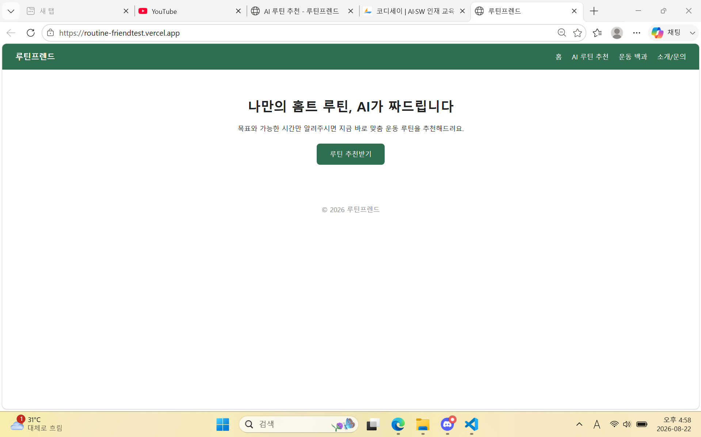
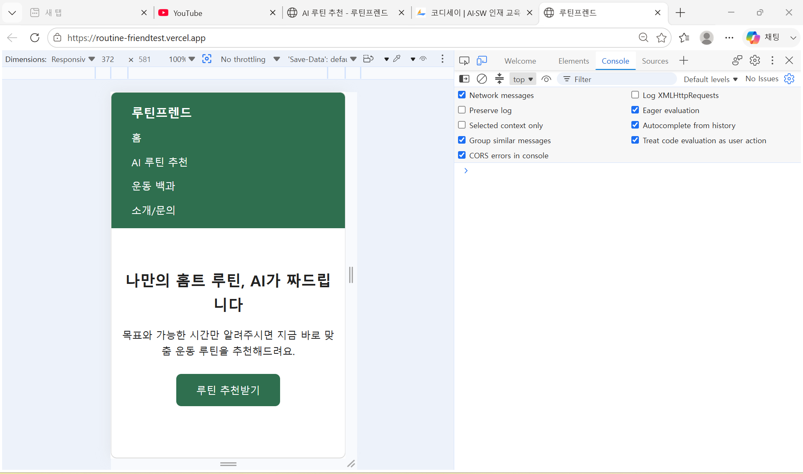
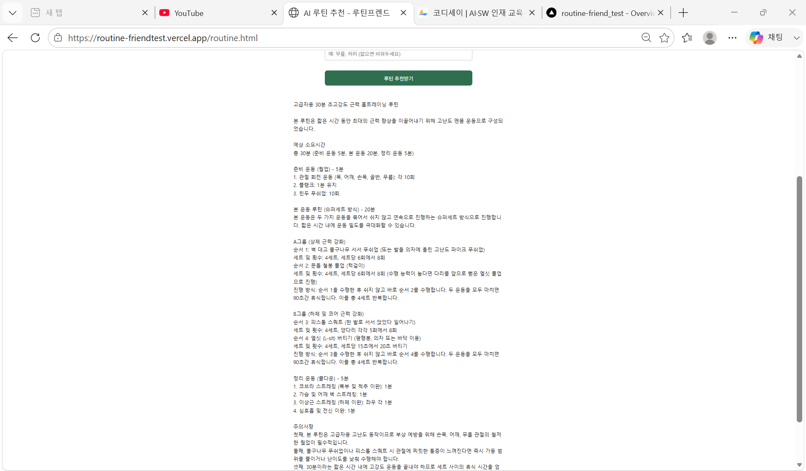

# 🏋️ Mission C2-03 — AI 웹 서비스 빌딩 (루틴프렌드)

> AI 코딩 도구를 활용해 직접 만들고 배포한 웹 서비스입니다. 헬스장 등록이 부담스러운 홈트 초보자에게, 목표·경험·가용 시간을 입력하면 AI가 맞춤 운동 루틴을 즉석에서 추천합니다.

| 항목 | 내용 |
|---|---|
| **배포 URL** | **https://routine-friendtest.vercel.app** |
| **프로그램 저장소** | **https://github.com/rhgksruf472/routine-friend** |
| 페이지 | 4개 — 홈 / AI 루틴 추천 / 운동 백과 / 소개·문의 (공통 `<nav>` 멀티페이지 이동) |
| AI 기능 | AI 루틴 추천 — Google Gemini API (`gemini-3.5-flash`), 입력 → 결과 출력 |
| 보너스 | 미수행 (다크 모드 · 운영 자동화 모두 사용자 판단으로 건너뜀) |
| 과제 원문 | [`codyssey.md`](codyssey.md) |
| 서비스 기획서 | [`service-plan.md`](service-plan.md) |
| AI 코딩 도구 사용 증빙 | [`ai-tool-usage-log.md`](ai-tool-usage-log.md) |

---

## 목차

1. [미션 요약](#미션-요약)
2. [페이지 구성](#페이지-구성)
3. [AI 기능 — AI 루틴 추천](#ai-기능--ai-루틴-추천)
4. [기술 스택 · 실행 방법](#기술-스택--실행-방법)
5. [스크린샷](#스크린샷)
6. [주요 디버깅 사례](#주요-디버깅-사례)
7. [과제 목표 대응표](#과제-목표-대응표)
8. [저장소 구조](#저장소-구조)
9. [보너스 미수행 사유](#보너스-미수행-사유)

---

## 미션 요약

이번 미션의 핵심은 AI 코딩 도구로 코드를 생성하더라도 **웹이 어떻게 구성되는지 이해하고, 오류가 나면 원인을 직접 파악·수정**하는 것입니다.

- 순수 HTML/CSS/JavaScript 프론트엔드 (프레임워크 미사용) + Vercel Serverless Functions(Python) 백엔드
- AI API(Google Gemini)를 연동한 실시간 루틴 추천 기능 1개
- 배포 후 발생한 여러 실제 오류를 브라우저 콘솔·서버 로그로 직접 추적해 수정 ([디버깅 사례](#주요-디버깅-사례))
- 반응형 레이아웃을 배포 URL 기준으로 데스크톱·모바일 두 가지 화면 크기에서 직접 확인

## 페이지 구성

| 페이지 | 역할 |
|---|---|
| 홈 (`index.html`) | 서비스 소개 + "루틴 추천받기" CTA |
| **AI 루틴 추천** (`routine.html`) | 입력 폼 → Gemini 호출 → 맞춤 루틴 결과 표시 (핵심 기능) |
| 운동 백과 (`encyclopedia.html`) | 기본 운동 5종 정적 콘텐츠 |
| 소개/문의 (`about.html`) | 서비스 소개, 문의 폼 |

## AI 기능 — AI 루틴 추천

| 구분 | 내용 |
|---|---|
| 입력 | 목표(체중감량/근력/유연성/자세교정), 운동 경험(초급/중급/고급), 하루 가용 시간(15~60분), 부상·제약 부위(선택) |
| 출력 | 운동 목록(운동명·세트/횟수·순서), 예상 소요시간, 주의사항 |
| 실패 처리 (3종 모두 구현) | 빈 입력 → "목표와 가능 시간을 선택해주세요" 안내 / API 오류(4xx/5xx) → 오류 안내 문구 / 응답 지연 → 로딩 표시 + 503 최대 3회 자동 재시도 |

## 기술 스택 · 실행 방법

프론트엔드=순수 HTML/CSS/JS, 백엔드=Vercel Serverless Functions(Python), AI=Google Gemini API. 상세 실행·배포 방법과 환경 변수 설정법은 프로그램 저장소의 [routine-friend/README.md](https://github.com/rhgksruf472/routine-friend#readme)에 정리되어 있습니다.

## 스크린샷

배포 URL(`https://routine-friendtest.vercel.app`)에서 직접 촬영했습니다. 원본은 [`screenshots/`](screenshots/) 폴더에 있습니다.

<details open>
<summary><b>데스크톱 화면</b> — <code>screenshots/desktop.png</code></summary>



</details>

<details open>
<summary><b>모바일 화면</b> (DevTools 반응형, 372×581) — <code>screenshots/mobile.png</code></summary>



</details>

<details open>
<summary><b>AI 루틴 추천 동작 장면</b> — <code>screenshots/ai-feature-result.png</code></summary>



입력 폼 제출 후 Gemini가 생성한 맞춤 루틴(운동 목록, 예상 소요시간, 주의사항)이 화면에 표시된 상태입니다.

</details>

## AI 코딩 도구 사용 과정

Claude Code(AI 코딩 도구)와의 실제 대화에서 대표 사례 2건을 발췌해 [`ai-tool-usage-log.md`](ai-tool-usage-log.md)에 정리했습니다 — AI가 코드를 직접 고치지 않고 원인만 설명하면, 실제 수정·git 명령·재배포·재확인은 전부 사용자가 직접 수행한 과정입니다.

## 주요 디버깅 사례

AI 코딩 도구가 생성한 코드라도 오류가 나면 직접 원인을 파악해야 한다는 과제 목표에 따라, 배포 후 실제로 겪은 두 가지 사례를 정리했습니다.

### 1. AI 기능 500 에러 — 원인이 네 겹이었던 사례

배포 URL에서 AI 기능이 500을 반환했고, "브라우저 콘솔 → Vercel 서버 로그 → traceback → 값 자체 진단" 순으로 한 겹씩 벗겨내며 원인 네 개를 순서대로 찾아냈습니다.

| 증상 | 실제 원인 | 해결 |
|---|---|---|
| 콘솔에 `500`만 보이고 원인 불명 | `except Exception`이 원인을 삼킴 | `traceback.print_exc()` 추가 → 서버 로그에서 실제 예외 확보 |
| `credit balance is too low` | 코드가 아니라 **Anthropic 계정 크레딧 부족** (Claude 구독 ≠ API 과금) | 무료 티어가 있는 Gemini로 전환 |
| 모델 목록 조회 `400 API_KEY_INVALID` | 로컬 `.env`의 `GEMINI_API_KEY` 자리에 Claude 키가 들어 있었음 | 올바른 Gemini 키로 교체 |
| 로컬은 되는데 배포만 403 | 키 값 노출 없이 `len`/앞 3글자만 로그로 진단 → **Vercel 대시보드에 환경변수 미등록** | 값 등록 + Redeploy |

### 2. 페이지마다 다른 콘솔 에러 — `js/main.js` 중복 파일

`js/main.js`에 `js/routine.js`와 똑같은 폼 처리 코드가 통째로 중복되어 있었는데, 이게 페이지마다 **서로 다른** 에러로 나타났습니다.

| 페이지 | 콘솔 에러 | 원인 |
|---|---|---|
| `index.html` | `TypeError: Cannot read properties of null (reading 'addEventListener')` | 이 페이지엔 `routine-form` 요소가 없어 `null.addEventListener()` 호출 |
| `routine.html` | `SyntaxError: Identifier 'form' has already been declared` | `main.js`와 `routine.js`가 똑같이 `const form`을 선언해 이름 충돌 |

같은 근본 원인이 페이지 구성에 따라 다른 증상으로 나타난 사례로, `main.js`를 "여러 페이지가 공유하는 코드" 자리로 비우고 폼 처리 로직은 `routine.js`에만 남기는 방식으로 해결했습니다.

## 과제 목표 대응표

과제 원문 "3. 과제 목표" 6개 항목이 이 저장소의 어떤 결과물로 뒷받침되는지 정리했습니다.

| 과제 목표 | 근거 |
|---|---|
| HTML/CSS/JS가 각각 어떤 역할을 하는지 설명할 수 있다 | 4개 HTML(구조) + `css/style.css`(스타일·반응형) + `js/routine.js`(동작) 분리 구조 |
| 사용자 입력 → fetch 요청 → 응답 화면 반영 흐름을 설명할 수 있다 | `js/routine.js`의 `fetch('/api/routine', {method:'POST'})` → `response.json()` → `#routine-result`에 반영 |
| Vercel Serverless Functions가 무엇이고 프론트에서 어떻게 호출하는지 설명할 수 있다 | `api/routine.py`(`class handler(BaseHTTPRequestHandler)`)와 `fetch('/api/routine')` 경로 매칭 |
| 환경 변수로 API 키를 관리해야 하는 이유를 설명할 수 있다 | `os.environ.get('GEMINI_API_KEY')` — 공개 저장소에 올라가는 코드에 키 값을 남기지 않기 위함 |
| 로컬 환경과 배포 환경의 차이를 이해하고 수정·재배포 흐름을 설명할 수 있다 | `vercel dev` 로컬 에뮬레이터 Python 버전 불일치, 스크린샷 재촬영(`file://` vs 배포 URL) 두 사례 |
| AI 생성 코드의 오류 원인을 직접 파악·수정할 수 있다 | [주요 디버깅 사례](#주요-디버깅-사례) — 500 에러 4겹, `main.js` 중복 파일 |

## 저장소 구조

```
C2_mission-03/
├── codyssey.md                  # 과제 원문
├── service-plan.md              # 서비스 기획서
├── ai-tool-usage-log.md         # AI 코딩 도구 사용 과정 증빙 (대화 발췌)
├── README.md                    # 이 문서
└── screenshots/                 # 데스크톱·모바일·AI 기능 스크린샷 3장
```

프로그램 코드는 이 저장소가 아니라 **별도 GitHub 저장소**([routine-friend](https://github.com/rhgksruf472/routine-friend))에 있습니다 — Vercel이 저장소 루트를 그대로 배포 대상으로 잡아 연동이 가장 단순하기 때문입니다.

`requirements-checklist.md`, `QnA.md`는 저장소 루트 `.gitignore`에 등록되어 있어 GitHub에 올라가지 않습니다.

## 보너스 미수행 사유

보너스 1(운영 자동화)·보너스 2(UX 고도화/다크 모드) 모두 이번 미션에서는 진행하지 않기로 사용자가 직접 판단해 확정했습니다. 다크 모드는 CSS 변수(`:root` / `:root[data-theme="dark"]`) 설계까지 안내된 상태에서 코드 반영 전 취소되었으며, 그 외 되돌릴 변경 사항은 없습니다.
