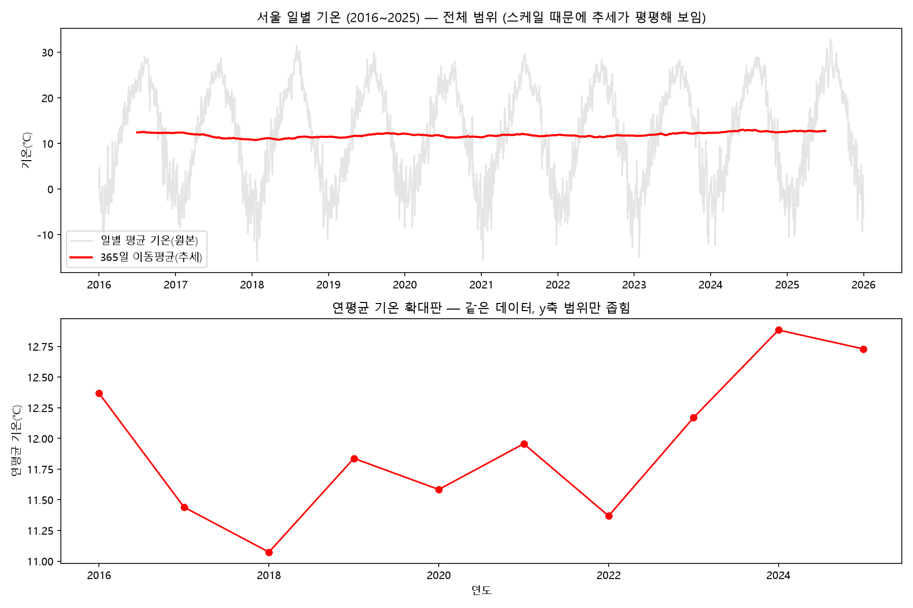
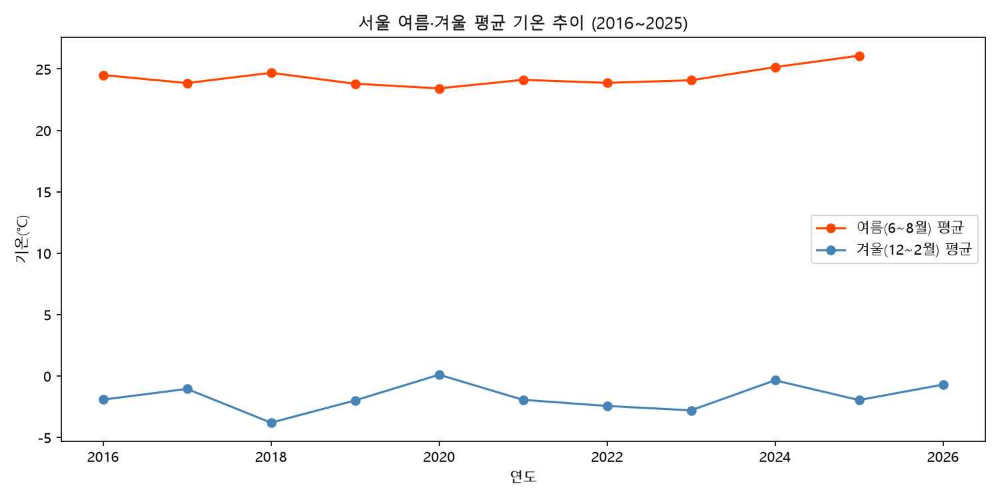
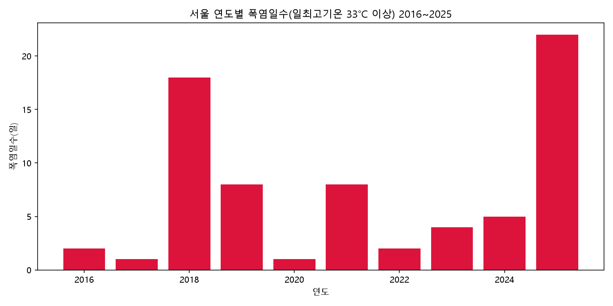

# C3 Mission 01 — 서울 일별 기온 시계열 분석 & 인사이트 리포트

| 항목 | 내용 |
|---|---|
| 분석 리포트 | [REPORT.md](REPORT.md) |
| 데이터 | [data/seoul_temperature_2016_2025.csv](data/seoul_temperature_2016_2025.csv) |
| 분석 코드 | [analysis.py](analysis.py) (+ [collect_data.py](collect_data.py), [explore_data.py](explore_data.py)) |
| 기간 | 2016-01-01 ~ 2025-12-31 (10년, 3,653일) |
| 핵심 결과 | 10년간 +0.97℃ 상승, 여름(+0.76℃)이 겨울(+0.58℃)보다 빠르게 더워짐, 폭염일수 중앙값 기준 +3.0일 증가 |

## 목차

- [개요](#개요)
- [실행 방법](#실행-방법)
- [폴더 구조](#폴더-구조)
- [데이터 출처 및 라이선스](#데이터-출처-및-라이선스)
- [주요 결과 미리보기](#주요-결과-미리보기)

## 개요

서울 일별 기온(2016~2025, 10년치)을 시계열 분석해 3가지 질문(연평균 추세 / 계절별 변화 속도 / 폭염일수 추이)에 답하고, 관찰과 해석을 구분해 인사이트를 도출한 미션입니다. 자세한 분석 과정과 결론은 [REPORT.md](REPORT.md)를 참고하세요.

## 실행 방법

```bash
# 1) 의존성 설치
pip install -r requirements.txt

# 2) 데이터 수집 (Open-Meteo API 호출, 키 불필요)
python collect_data.py

# 3) 데이터 기본 정보·결측치 확인 (선택)
python explore_data.py

# 4) 시계열 분석 + 시각화 3종 생성
python analysis.py
```

실행하면 `data/seoul_temperature_2016_2025.csv`와 `images/` 아래 그래프 3개(`01_yearly_trend.png`, `02_summer_winter.png`, `03_heatwave_days.png`)가 생성됩니다.

| 구분 | 내용 |
|---|---|
| Python 버전 | 3.10 이상 (개발 환경: 3.11.9) |
| 주요 라이브러리 | pandas 3.0.5, matplotlib 3.11.1, requests 2.34.2 (전체 목록: [requirements.txt](requirements.txt)) |

## 폴더 구조

```
C3_mission-01/
├── codyssey.md              # 과제 원문
├── README.md                # 이 문서
├── REPORT.md                # 분석 리포트 (최종 결과물)
├── collect_data.py          # 데이터 수집 스크립트
├── explore_data.py          # 데이터 기본 정보/결측치 확인 스크립트
├── analysis.py               # 시계열 분석 + 시각화 스크립트
├── requirements.txt          # 의존성 목록
├── data/
│   └── seoul_temperature_2016_2025.csv
└── images/
    ├── 01_yearly_trend.png
    ├── 02_summer_winter.png
    └── 03_heatwave_days.png
```

## 데이터 출처 및 라이선스

- **출처**: [Open-Meteo Historical Weather API](https://open-meteo.com/en/docs/historical-weather-api) — ERA5 재분석 자료 기반, API 키 불필요
- **라이선스**: Open-Meteo는 비상업적 용도에 한해 무료로 사용할 수 있으며, 상업적 이용 시 별도 라이선스가 필요합니다. 이 저장소는 학습 목적으로만 데이터를 사용합니다.
- **주의**: 이 데이터는 실제 관측소 측정값이 아닌 모델 기반 재분석 자료이므로, 실제 관측치와 미세한 차이가 있을 수 있습니다.

## 주요 결과 미리보기

<details>
<summary>연평균 기온 추세 (클릭해서 펼치기)</summary>



</details>

<details>
<summary>여름·겨울 기온 추이 (클릭해서 펼치기)</summary>



</details>

<details>
<summary>폭염일수 추이 (클릭해서 펼치기)</summary>



</details>

전체 해석과 결론은 [REPORT.md](REPORT.md)에 정리되어 있습니다.
